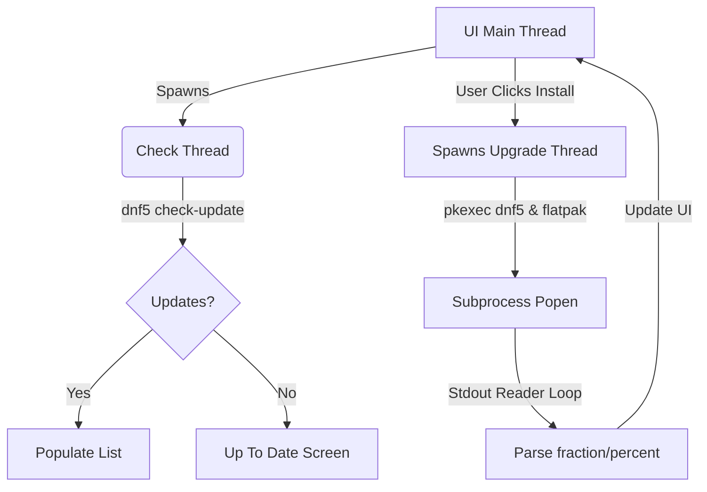

# How It Was Created: Fedora Software Updater

This document provides a breakdown of the engineering design choices, system assessments, and source code architecture used to build the **Fedora Software Updater**.

---

## 🔍 1. System Assessment & Environment

Before writing code, we performed a system probe to determine the desktop environment, package manager, and available programming libraries:
- **OS**: Fedora Linux 44
- **Desktop Environment**: KDE Plasma Edition (X11/Wayland with KDE Plasma desktop shell)
- **Primary Package Manager**: `dnf5` (Fedora 44's new, fast package manager)
- **Application Engine**: `flatpak` (sandboxed desktop applications)
- **Available UI Toolkits**:
  - Python `gi` (PyGObject/GTK): Available
  - Python `tkinter`: Available
  - Python `PyQt`/`PySide`: Not installed
  - `pip` (Python package manager): Not installed

### The Decision: Vanilla Python Tkinter
Because pip was not available on the machine, we chose to write the application using Python's standard `tkinter` library. Rather than relying on external packages like `customtkinter`, we created custom widgets from scratch to achieve a premium dark-themed web-style layout.

---

## 🎨 2. Styling and Theme Design

Standard Tkinter applications look outdated because they inherit default system layout borders and gray colors. To fix this, we implemented:
- **Palette**: Deep dark slate `#0F172A` (background), `#1E293B` (cards), `#334155` (hovers), and `#3B82F6` (accent blue buttons).
- **Custom Canvas Widgets**:
  - **Rounded Buttons (`ModernButton`)**: Created by subclassing `tk.Canvas` and drawing rounded polygons. It features dynamic state listeners for `<Enter>`, `<Leave>`, and `<Button-1>` to provide hover lighting and press animations.
  - **Rounded Progress Bar (`ModernProgressBar`)**: Inherits `tk.Canvas` and calculates width relative to the widget's container size dynamically during resizing.
  - **Vector Graphics Shields**: Renders flat colored shield shapes and drawing checkmark/warning ticks natively on canvas objects, maintaining crisp edges on high-density (HIDPI) displays.

---

## 🛠️ 3. Threaded Subprocess Mechanics

Executing system upgrades freezes the UI if run on the main graphical thread. To guarantee smoothness, we structured the architecture as follows:



---

## 🛡️ 4. Privilege Elevation & Polkit

Updating system software requires root privileges. We handled this securely by utilizing PolicyKit:
- **Command**: `pkexec bash -c "dnf5 upgrade -y && flatpak update -y"`
- **Polkit Integration**: When `pkexec` executes, the operating system catches the privilege elevation request and throws a graphical sudo-password prompt native to the desktop shell (KDE PolicyKit Agent).
- **Error/Cancel Catching**: If the user cancels the Polkit prompt, `pkexec` exits with exit code `127`. The script detects this code and displays an authorization cancellation warning on screen.

---

## 📊 5. Output Parsing & Progress Tracking

Rather than showing a standard spinning circle during installation, the script parses `stdout` in real-time to compute progress:
1. **Fractional Progress**: DNF5 prints lines like `[ 15/48] Upgrading less.x86_64...`. The script matches this pattern:
   ```python
   match_fraction = re.search(r'\[\s*(\d+)\s*/\s*(\d+)\s*\]', line)
   ```
2. **Phase Mapping**: The progress bar is segmented across three sequential phases to avoid jumping backward:
   - **Download phase**: Maps fraction progress from `0.05` to `0.40`.
   - **Installation phase**: Maps fraction progress from `0.40` to `0.85`.
   - **Flatpak upgrade phase**: Maps flatpak percentage progress from `0.85` to `0.98`.
   - **Completion**: Snaps to `1.0` upon process success.
